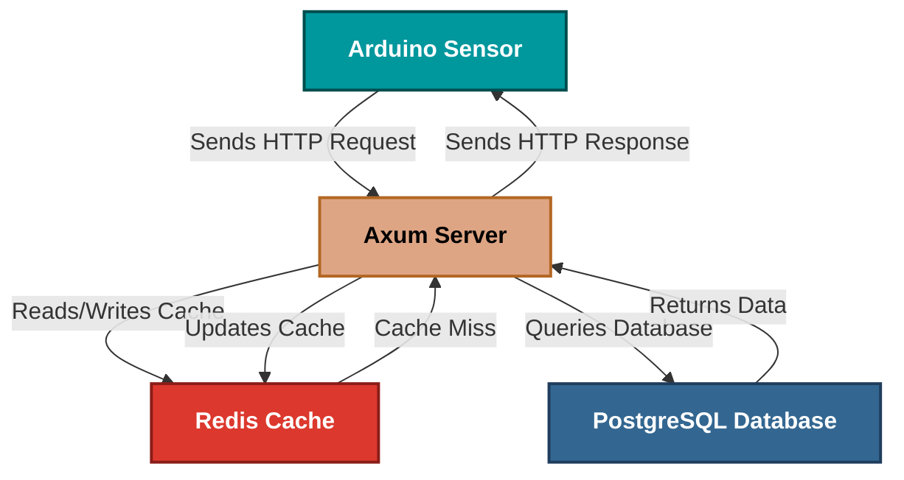

<div align="center">
    <h1>SpeedStream</h1>
</div>

<div align="center">
    
    
    
    
    
</div>

## 📖 Overview

SpeedStream is a fast REST API built with Rust and Axum, specifically designed for real-time speed data
collection and monitoring. Perfect for vehicle tracking speed systems and performance monitoring applications.

## ✨ Key Features

- ⚡ Ultra-Fast: Can handle thousands of requests per second with minimal latency
- 🔒 Memory Safe: Built with Rust's zero-cost abstractions and memory safety
- 🏗️ Production Ready: Comprehensive error handling, logging, and health checks
- 🌐 IoT Friendly: Optimized for Arduino, Raspberry Pi, and other embedded devices

## 💻 Platform Support

<div align="center">
  <a href="#macos">
    
  </a>
  <a href="#linux">
    
  </a>
  <a href="#windows">  
    
  </a>
    <a href="#docker">
        
    </a>
</div>

## 📋 Prerequisites

- **Rust Compiler** (Install via [Rustup](https://rustup.rs/))
- **Cargo Package Manager** (Installed with Rust)

## 🚀️ Endpoints

See the [API Documentation](./docs/ENDPOINTS.md) for detailed information on available endpoints.

## 📊 Architecture Diagram



## 🛠 Code quality

### Unit Tests available

- **Run Tests**:
  ```bash
  cargo test
  ```
  
## 🤝 Contributing

Contributions are welcome! To contribute:

- **Fork the Repository**
- **Create a Feature Branch**:
  ```bash
  git checkout -b feature/your-feature-name
    ```
