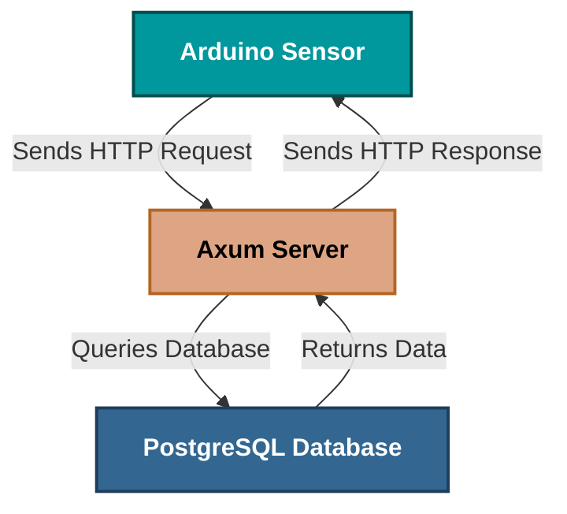

<div align="center">
    <h1>SpeedStream</h1>
</div>

<div align="center">
    
    
    
    
</div>

## 📖 Overview

SpeedStream is a blazingly fast REST API built with Rust and Axum, specifically designed for real-time speed data
collection and monitoring. Perfect for IoT sensors, vehicle tracking systems, and performance monitoring applications.

## ✨ Key Features

- ⚡ Ultra-Fast: Can handle thousands of requests per second with minimal latency
- 🔒 Memory Safe: Built with Rust's zero-cost abstractions and memory safety
- 🏗️ Production Ready: Comprehensive error handling, logging, and health checks
- 🌐 IoT Friendly: Optimized for Arduino, Raspberry Pi, and other embedded devices

## 💻 Platform Support

<div align="center">
  <a href="#macos">
    
  </a>
  <a href="#linux">
    
  </a>
  <a href="#windows">  
    
  </a>
    <a href="#docker">
        
    </a>
</div>

## 📋 Prerequisites

- **Rust Compiler** (Install via [Rustup](https://rustup.rs/))
- **Cargo Package Manager** (Installed with Rust)

## 🚀️ Endpoints

- **GET /health**: Check the health status of the API.
- **POST /api/create-speed**: Submit new speed data into the database.
- **GET /api/get-speed?limit=500**: Retrieve speed data with a limit on the number of records returned.
- **GET /api/get-speed/pagination?offset=0&limit=500**: Retrieve speed data with pagination support.
- **GET /api/get-speed/today**: Retrieve speed data for today with pagination support.

## 🧪 Example Usage

### 1. Insert Speed Data

```bash
curl -X POST http://localhost:3000/api/create-speed \
  -H "Content-Type: application/json" \
  -d '{
    "speed":145
  }'
```

### 2. Retrieve last n records of Speed Data

```bash
curl -X GET http://localhost:3000/api/get-speed?limit=500
```

### 3. Retrieve Speed Data with Pagination

```bash
curl -X GET http://localhost:3000/api/get-speed/pagination?offset=0&limit=500
```

## 📊 Architecture Diagram



## 🤝 Contributing

Contributions are welcome! To contribute:

- **Fork the Repository**
- **Create a Feature Branch**:
  ```bash
  git checkout -b feature/your-feature-name
    ```